# MyWallet

## What is it?
**MyWallet** is an client-server application that allows you to manage your home spendings.  
It was created as Mobile Systems Programming final project by **Adrian Michalski** and **Kamil Maj**.

## How to run it?
### Bitnami WildFly stack installation
Simply download installation package from https://bitnami.com/stack/wildfly and install it.  
**Notice**: Don't forget usernames and passwords, they will be used later in WildFly and MySQL administation consoles.

### MySQL
Create mywallet database in MySQL admin  
`CREATE DATABASE mywallet;`  
And that's it :)

### WildFly
#### Datasource configuration
  - Log in to management console (http://localhost:9990/console/App.html)
  - Configuration -> Subsystems -> Datasources -> Non-XA -> Add -> MySQL Datasource
  - Name: `MyWalletDS`  
    JNDI Name: `java:/jboss/datasources/MyWalletDS`
  - Detected driver -> mysql-connector-java-5.1.37-bin.jar_com.mysql.jdbc.Driver_5_1
  - Connection URL: `jdbc:mysql://localhost:3306/mywallet`  
    Username: `root`  
    Password: `changeme`
  - Test connection - *"Successfully created JDBC connection"* message should appear

If you remove default datasource it might be necessary to use this command:
`/subsystem=ee/service=default-bindings:undefine-attribute(name=datasource)`

#### Application deployment
1. Build .war file
 - go to mywallet server directory (where the pom.xml file is)
 - run `mvn clean package`
 - `mywallet.war` should appear in the `target` directory
2. Deploy .war file
 - go to `bin` in under WildFly root directory
 - connect to JBoss Comman Line by typing `jboss-cli.bat --connect`
 - after connecting to jboss-cli type `deploy C:\path\to\mywallet.war`

## How to use it?
### API
#### Entities
##### Entry
- id - *Number* (used only in queried entities)
- createDate - *Date* (used only in queried entities)
- value - *Number*
- description - *String*
- tags - *Set of Strings*

##### Tag
- id - *Number* - (used only in queried entities)
- name - *String* - name without hash character (#)
- description - *String* - Optional
- entries - *Set of Numbers* - ids of all entries assigned to this tag

#### Endpoints
##### All entries
**GET** on `/mywallet/entries`

##### Account balance (sum of all entry values)
**GET** on `/mywallet/entries/balance`

##### Entries by tag
**GET** on `/mywallet/entries/{tagName}`

##### Sum of entry values by tag
**GET** on `/mywallet/entries/{tagName}/sum`

##### Add entry
**POST** on `/mywallet/entries` with *Entry* DTO in request's body. For example:
```javascript
{
  "value": 54.2,
  "description": "tankowanie bp #paliwo",
  "tags": [
    "paliwo"
  ]
}
```

##### Remove entry
**GET** on `/mywallet/entries/delete/{entryId}`  
**Notice**: GET method used because Volley does not support DELETE method properly.

### Android client
#### Installation
First build and install .apk on your device.

#### Usage
##### Set up
At first run application will ask you for MyWallet server address.
If you are using local wildfly installation (as described before) it will be simply  
`http://localhost/mywallet`  
  
After entering proper server URL click the **CONTINUE** button.

If you enter wrong server address screen will look like this:  
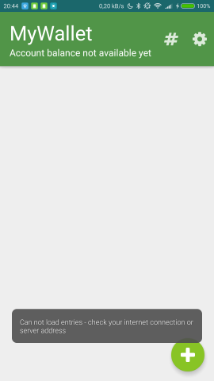  
Otherwise you are ready to add new entries.  
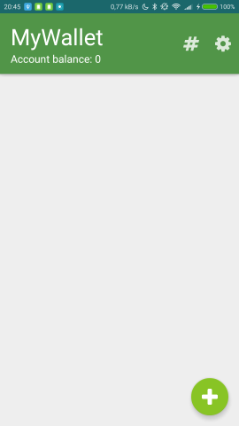  

If you want to change server address just click on **GEAR** settings button in top-right corner.

##### Working with application
###### Adding entries
To add new entry click on green floating plus button **(+)**.

Let's assume your salary for May have just arrived, so we can type:  
`#salary may 2500`  
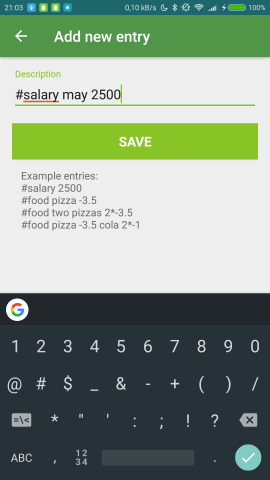  

click on **SAVE** button and entry is added.  
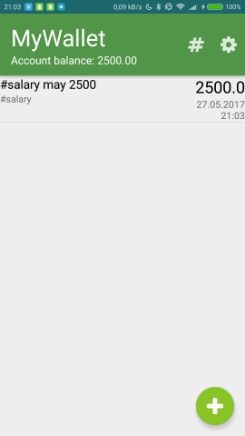  
You can see, that entry is present and account balance is updated.

If you are on dinner you can type:  
`#food dinner -15`  
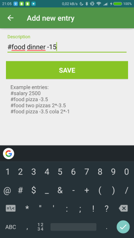  
And $15 from your account have just gone.  
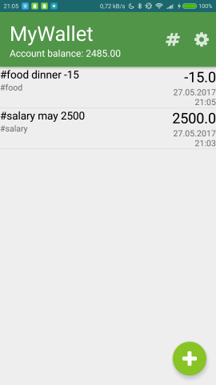  

If you are on dinner with your friend and you buy 2 pizzas just type:  
`#food pizza with Bob 2*-10`  
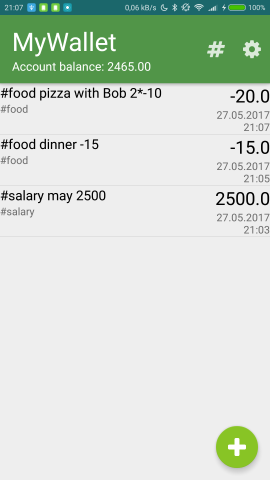  
As you can see MyWallet can do simple math for you :)

What if you are on dinner with your vegan friend?  
`#food chicken bbq pizza -10 grilled potatoes 5*-0.5`  
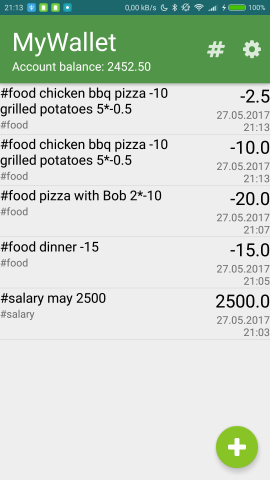  
My wallet will do proper math and split your entry.

If you're using app on other device and you have just added another entry you can refresh view by swiping down the screen (just like in your Internet browser).  
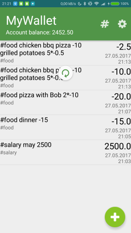  

###### Viewing statistics
Now we can check how much money we spent on food.
Let's click on **HASH (#)** button on the toolbar...   
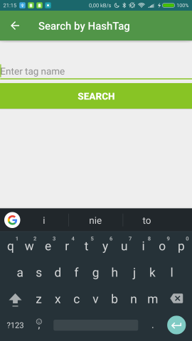  
...and enter food in tag name.  
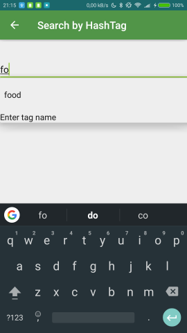  
If tag name is long just type first few characters and app will auto complete the rest for you.  
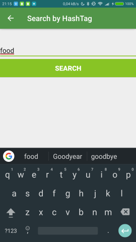  
Click **SEARCH** button and you know you have spent $47.5 for food.  
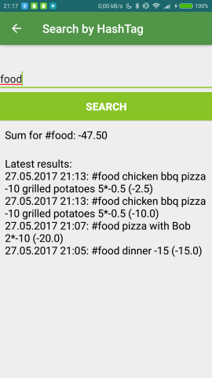

###### Deleting entries
If you want to delete entry just click and hold your finger on it.  
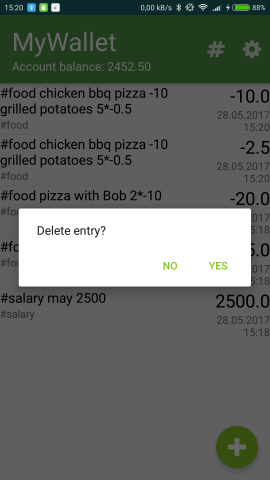  
Click yes.  
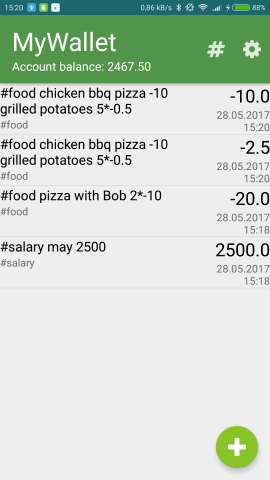  
And it's gone :)
